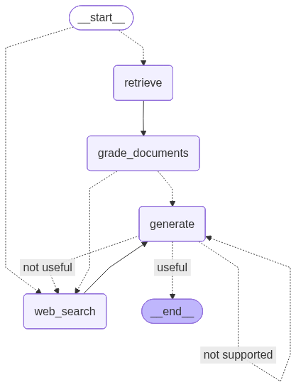

# Agentic Document RAG

This project implements an "agentic" Retrieval-Augmented Generation (RAG) system for querying documents. It uses a graph-based agent framework (likely LangGraph) to create a stateful, multi-step process for retrieving information and generating answers.

The core of the project involves ingesting documents into a ChromaDB vector store and then using a language model (LLM) agent to intelligently query this store, assess the retrieved information, and generate a comprehensive answer.

## Features

* **Document Ingestion**: Script (`ingestion.py`) to process and load documents into a vector database.
* **Vector Store**: Uses **ChromaDB** for efficient similarity search.
* **Agentic Framework**: Employs a graph-based agent (likely **LangGraph**) to manage a stateful RAG flow (e.g., query, retrieve, grade documents, generate answer).
* **Dependency Management**: Uses **Poetry** for clear and reproducible dependency management.

## Architecture

The project likely follows this flow, as suggested by the `graph.png` and file structure:

1.  **Ingestion**: Documents are loaded, split into chunks, and embedded using a sentence-transformer or an API-based embedding model. These embeddings are stored in a persistent ChromaDB collection.
2.  **Agentic RAG**:
    * A user query is received.
    * **Retrieve**: The query is used to retrieve relevant document chunks from ChromaDB.
    * **Grade**: An agent node grades the retrieved documents for relevance to the query.
    * **Decide**: A conditional edge decides whether to generate an answer (if documents are relevant) or to end the process (if not).
    * **Generate**: The relevant documents and the user query are passed to an LLM to generate a final, grounded answer.
    * **Hallucination Check Grader**: Check if the generated answer is grounded with the documents.
    * **Answer Grader**: Check if the generated response answers the query.
## Workflow


## Getting Started

### Prerequisites

* Python 3.10+
* [Poetry](https://python-poetry.org/docs/#installation) (for dependency management)
* An API key from an LLM provider (e.g., OpenAI, Anthropic, Gemini, or Groq)

### 1. Clone the Repository

```bash
git clone https://github.com/kira2406/agentic-document-rag.git
cd agentic-document-rag
```

### 2. Install Dependencies

Install the required Python packages using Poetry:

```bash
poetry install
```

### 3. Set Up Environment Variables

Copy the example environment file and add your API keys and configuration settings.

```bash
cp .env.example .env
```

Now, edit the `.env` file with your credentials:

```ini
# .env
# Example for OpenAI
OPENAI_API_KEY="sk-..."

# Example for Tavily (if used for web search)
# TAVILY_API_KEY="tvly-..."

# Example for LangSmith (optional, for tracing)
# LANGCHAIN_TRACING_V2="true"
# LANGCHAIN_API_KEY="..."
```

## Usage

There are two main steps to using this project:

### 1. Ingest Documents

First, you must specify your URLs of your documents and load them into the vector store.

Add the urls in the `ingestion.py` file

```bash
urls = [
    "https://lilianweng.github.io/posts/2023-06-23-agent/",
    "https://lilianweng.github.io/posts/2023-03-15-prompt-engineering/",
    "https://lilianweng.github.io/posts/2023-10-25-adv-attack-llm/",
]
```

Run the ingestion script:

```bash
poetry run python ingestion.py

```

This will create or update the `.chroma` directory with your document embeddings.

### 2. Run the RAG Agent

Once your documents are ingested, you can run the main application to start querying:

```bash
poetry run python main.py
```

This will likely launch an interactive command-line interface (CLI) where you can ask questions about your documents.

## File Structure

```
.
├── .chroma/         # Persistent ChromaDB vector store
├── graph/           # (Likely) Saved graph state or related files
├── .env.example     # Example environment variables
├── .gitignore
├── graph.png        # Diagram of the agentic graph
├── ingestion.py     # Script for loading documents into ChromaDB
├── main.py          # Main application file, defines and runs the agent
├── poetry.lock      # Poetry lock file
├── pyproject.toml   # Project dependencies and metadata
└── readme.md        # This file
```